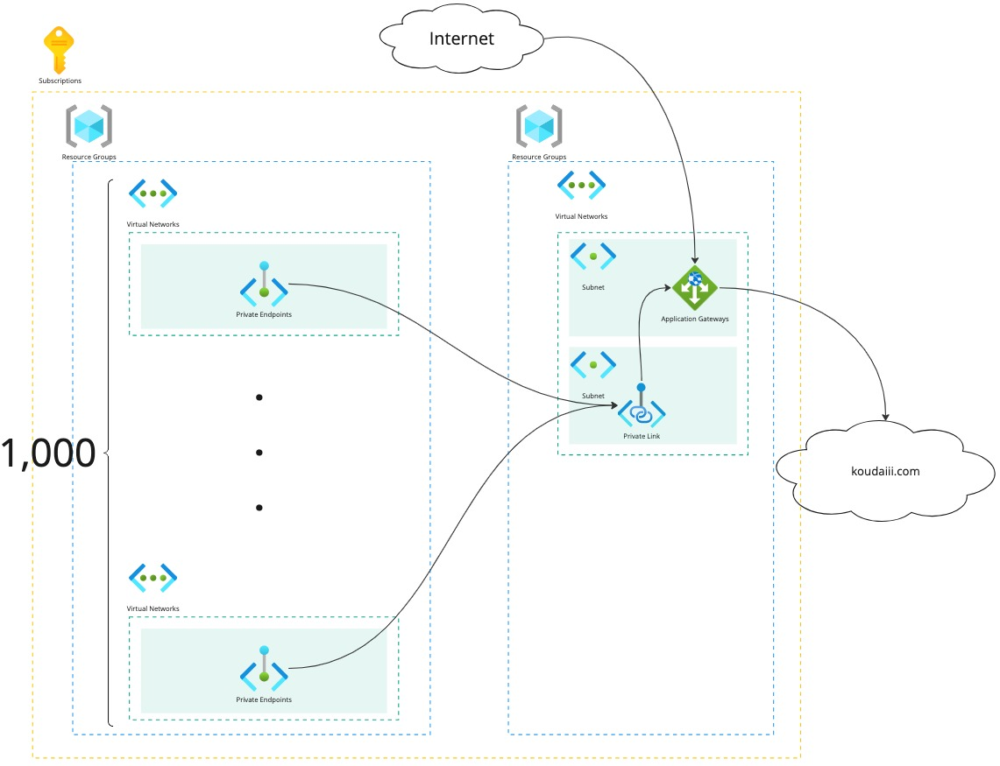

# 1000-privante-endpoint-per-private-link



<!-- @import "[TOC]" {cmd="toc" depthFrom=1 depthTo=6 orderedList=false} -->


This script is for creating a private link for application gateway in a resource group and for creating 1000 private endpoints and vnet in a resource group.

1. Create resource group
2. Create vnet and subnet
3. Create Application Gateway
4. Create private link from the application gateway
5. Set 8 private ipaddress of application gateway praivate link config
6. Create another resource group
7. Create 1000 vnet and private endpoint
5. Delete all resource groups

## Required

- `az` cli
- azure subscription
- subscription contributor role

## Usage

```console
$ ./1000pe-appgw -s <subscription-id> -g <resource-group>
```

**Note:** When using this script, please be aware of the subscription limits on a per-region basis. If you encounter the error message "Cannot create more than 1000 virtual networks for this subscription in this region.", it means you have reached the limit.

```console
(VnetCountLimitReached) Cannot create more than 1000 virtual networks for this subscription in this region.
Code: VnetCountLimitReached
Message: Cannot create more than 1000 virtual networks for this subscription in this region.
```
